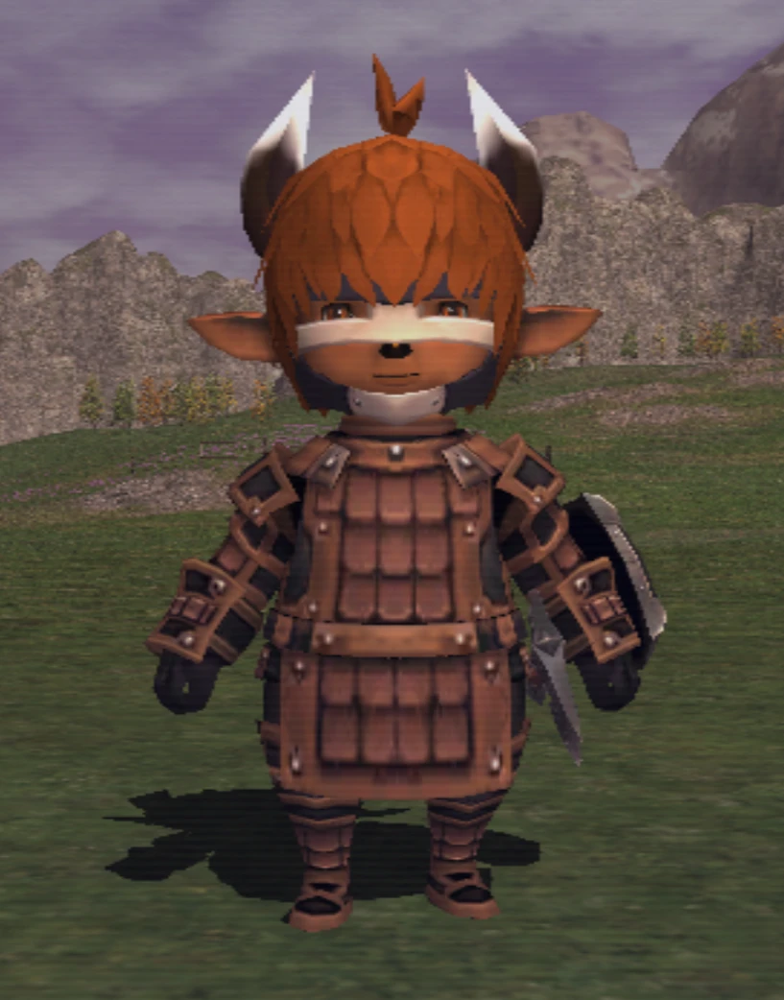

# FFXI DAT ⇄ Blender

A Blender add-on that opens Final Fantasy XI model DATs directly and writes new ones back.
You can **add, delete or reshape geometry**: vertex and triangle counts are rebuilt on export.
No Model Viewer, Metasequoia or Noesis round trip is needed.

Changes only affect what your own game client displays.

---

## Quick guide

### 1. One-time setup
1. In Blender (4.1 or newer; tested on 5.2), go to **Edit → Preferences → Add-ons → ▾ → Install from Disk**.
2. Pick `ffxi_dat_io.py`, then tick **FFXI DAT Mesh Import/Export**.

### 2. Import
1. Copy the game DAT you want to edit into a work folder, together with the race skeleton (`93.DAT` for Tarutaru).
2. Go to **File → Import → FFXI DAT** and pick the model (e.g. `100.dat`).
3. The skeleton is found automatically. If it isn't, a **Use as Skeleton** window opens: pick `93.DAT`.

### 3. Add geometry
1. Select the mesh to extend (e.g. `hh_h`) and press **Tab** to enter Edit Mode.
2. Add or extrude geometry. If you modeled a part as a separate object, select it, then the FFXI mesh, and press **Ctrl+J** to join them.
3. **Mirrored meshes** (they show a *mirror preview* modifier) hold only one half. Build on the **+X side** only, and the game adds the other side.
4. **Shade Smooth** new parts. Hard edges and flat faces use up extra vertices.
5. **UVs:** unwrap the new faces and place them on the existing texture in the UV Editor. To change the texture itself, use Tex Hammer.
6. **Weights:** optional. Unweighted vertices copy the bone weights of the nearest original vertex.
7. Keep an eye on the **FFXI budget**, in the bottom-left of the viewport and in the **N → FFXI** tab. Stay under 100%.

### 4. Export
1. Go to **File → Export → FFXI DAT** and save under a **new name**. Your source DAT is never overwritten.
2. Read the messages at the bottom of the window, especially any warnings about the budget or mirroring.

### 5. Put it in the game
1. Find the original file in your FFXI folder under `ROM…\<folder>\<file>.DAT` (e.g. `ROM\46\100.DAT`).
2. **Back it up.**
3. Rename your exported file to exactly the same name and copy it over the original.
4. Start the game. To undo, copy the backup back.

**Tip:** start with a small addition, such as extruding one face, to confirm your client loads added geometry before you spend time modeling.

---

## Reference

### How the skeleton is found on import
Blender can't open a file browser *inside* another one, so the import dialog has no folder
button for the skeleton. Instead:
- **Remembered:** the skeleton from your last import is pre-filled on the right. Click ✕ to clear it when you switch race.
- **Auto-detected:** if that box is empty and the model's folder holds exactly one skeleton DAT, it's used.
- **Asked:** otherwise a second file browser, **Use as Skeleton**, opens right after the first one closes.

You can also paste a path into the box. A DAT without a skeleton, or a skeleton with too few
bones for the model (wrong race), is refused with a message. Textures are written as `.dds`
files into `<model>_textures/` next to the DAT.

### Mesh budget
The budget shows how full each mesh is. It updates as you edit, including in Edit Mode, and
uses the same calculation as the exporter.

**The limit is size, not vertex count.** Every size field in a mesh chunk's header is a 16-bit
count of 2-byte words, so one mesh can be at most **65,535 words (~128 KB)**:

| Item | Words |
|---|---|
| Vertex weighted to 1 bone | 14 |
| Vertex weighted to 2 bones | 30 |
| Triangle | 15 |
| Each material switch | 32 |

Each mesh can also use at most **128 bones**. That count includes mirror partners, which are
added automatically. For scale, the Tarutaru face/hair mesh `hh_h` uses about 15% of the limit.
Export refuses a mesh that's over the limit and says by how much.

- **Mirrored meshes:** only the stored half counts. The game builds the mirror copy at load time
  from the same data, so it costs no file space (it's still drawn). Blender's own *Statistics*
  overlay includes the preview Mirror modifier and shows double, so go by the FFXI budget instead.
- **Hard edges cost vertices:** FFXI stores one normal per vertex, so a vertex on a hard edge or
  flat-shaded face is written once per distinct normal. UV seams cost nothing, because UVs are stored per triangle.
- The 65,535-word limit comes from the file format. The game engine's own practical limit is
  untested, so grow meshes gradually and check them in game.

### Rules worth knowing
- **Mirrored meshes** (e.g. `hh_h`) are drawn twice by the game, mirrored across the centre line.
  Anything past X = 0 gets doubled. For a one-sided addition, use a non-mirrored mesh such as `hf_h`.
- Don't rename or unparent the mesh objects or the armature. They carry the link to the source DAT.
- Faces keep their original draw order and new faces are drawn last. That matters for
  semi-transparent parts such as hair.
- Some DATs hold several copies of a mesh at different detail levels (LODs). Edit each one you want
  the change to show up in; otherwise it can disappear at a distance.
- Chunks you don't edit (textures, animations, effects) are copied byte for byte from the source DAT.

### Why the Model Viewer / Noesis pipeline can't add geometry
1. **Geometry reverts.** Model Viewer's *DAT to MQO* writes a hidden `.mcd` table mapping each MQO
   vertex to an existing DAT vertex slot. *MQO to DAT* only overwrites those slots, so new
   vertices and faces are dropped.
2. **Upside down.** FFXI models are **−Y up**, with Z as left/right. Noesis writes that data into an FBX
   labelled Z-up, with extra rotations and a 0.01 scale, and Model Viewer's MQO uses a third convention.
   This add-on uses one fixed rotation, FFXI (x, y, z) → Blender (z, −x, −y), both ways.
3. **No index match.** Noesis splits every triangle corner into its own vertex and bakes in the
   mirrored half, so Model Viewer's index table can't map edits back.

### FFXI mesh format notes
- Vertices are stored in bone-local space. Two-bone vertices store `x1 x2 y1 y2 z1 z2 w1 w2 nx1 nx2 ny1 ny2 nz1 nz2`,
  with each bone's position and normal pre-multiplied by that bone's weight.
- Bone reference (u16): bits 0–6 are the bone-table index, bits 7–13 the bone used for the mirrored copy,
  and bits 14–15 the local axis flipped for the mirror (1 = X, 2 = Y, 3 = Z).
- Mesh header flag `u16 @ 0x04 == 1` marks a mesh the game also draws mirrored across Z = 0.
- Triangles are clockwise, UVs are floats stored per triangle, and triangle lists hold at most 128 triangles.

### What was verified
- Rebuilding every mesh of a Tarutaru face DAT without Blender reproduces the file **byte for byte**.
- An unchanged Blender import → export matches the original: positions within 1e-7; UVs, weights,
  bone table, mirror refs, materials and draw order exact.
- A test edit (a horn added to the mirrored hair mesh, and a second mesh extruded from 24 to 96 triangles)
  reads correctly in this add-on **and in Noesis**, an independent FFXI reader, with the horn mirrored to both sides.
- **In game:** an exported DAT with added horns loads in the game client. The horns are skinned to the
  head and mirrored to both sides by the game (see the screenshot at the top).

No game files are included in this repository. Use DATs from your own FFXI install.
